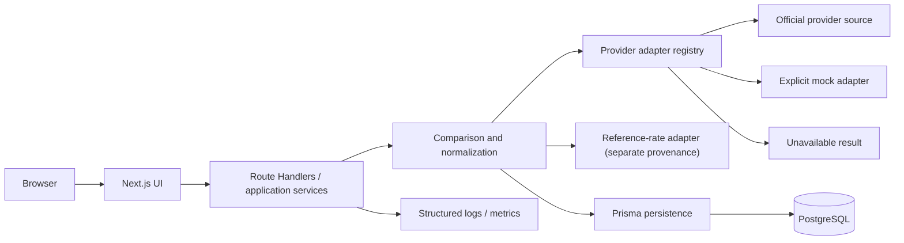
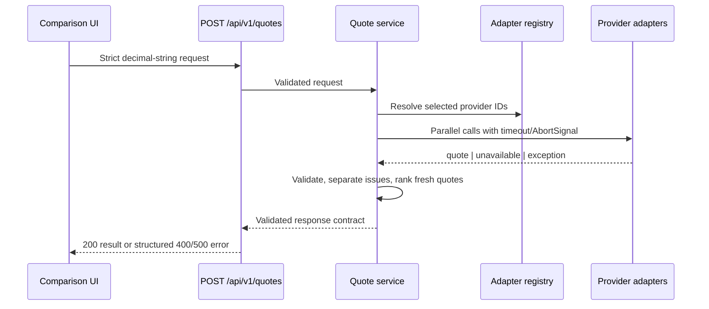

# NeoRate architecture

## System shape

NeoRate is a Next.js App Router application with a domain-first provider boundary. Server Components
compose read views; small Client Components own browser interaction. Route Handlers form the public
HTTP boundary. Provider adapters retrieve and validate provider-specific data, normalize it into a
discriminated `QuoteResult`, and pass it to comparison/application services. PostgreSQL stores
normalized history and availability events through Prisma.

The reference-rate path is intentionally separate. Reference rates may explain a spread, but cannot
be returned as a provider quote.

## Frontend/backend boundary

Interactive inputs and presentational formatting live in client components. Retrieval, secrets,
provider adapters, persistence and authoritative calculations run server-side. External consumers
will use versioned Route Handlers (planned `/api/v1/quotes`); internal mutations may later use Server
Actions. Domain objects crossing a boundary are runtime-validated.

## Provider adapters and ingestion

Each adapter implements `ProviderAdapter`, validates `QuoteRequest`, retrieves only approved data,
validates the raw response, maps plan/direction/fees/timestamps/provenance, and returns a normalized
result. Ingestion flow: schedule or request → adapter → raw validation → normalization → freshness
classification → persistence → cache → comparison response. Adapter failures become explicit
unavailable observations; they do not trigger a mid-rate fallback.

`ProviderAdapterRegistry` is the only runtime composition point. It exposes registration metadata,
adapter lookup and all configured adapters. Registrations distinguish `SUPPORTED` from deliberately
`UNAVAILABLE`; runtime timeout, exception and invalid-response failures become `FAILED` results.
Adding a provider requires its identifier/schema entry, one isolated adapter, contract tests and one
registry registration—quote orchestration and ranking contain no provider-specific branches.

## Normalization and comparison

Quotes keep source/target currency, source and resulting amounts, effective rate, explicit fee,
total cost, provider plan, rate and retrieval timestamps, source identifiers, data status, freshness
and reliability. Directions are independent; EUR/HUF and HUF/EUR are never inferred from each other.
Financial arithmetic uses decimal.js with 40-digit precision, never JavaScript `number`. Source
values remain decimal strings. The deterministic mock uses `ROUND_HALF_UP`: fees round to
source-currency scale, target values to target-currency scale, and effective rates to 8 decimal
places. The currently supported currency scales are EUR 2 and HUF 0. A real adapter must reproduce
its provider's documented rounding behavior instead of inheriting the mock policy.
In the foundation mock, `totalCost` equals the explicit fee because no verified reference spread is
available. Future spread-derived cost must be stored as a separately named component before it can
be included in `totalCost`, with the cost currency and methodology documented.

## Cache and update strategy

No shared cache is required in the foundation phase. A future adapter registry should use a short,
provider-specific TTL and cache keys containing provider, direction, amount band/amount, plan and
source version. Store `rateTimestamp` separately from `retrievedAt`. Serve stale numeric data only
when product policy permits it, preserve its original provenance, mark it `STALE`, display its age,
and refresh asynchronously. Never extend freshness after a failed refresh.

## Persistence

`Provider`, `ProviderPlan` and directional `CurrencyPair` are reference entities. `QuoteSnapshot`
stores available/stale normalized numeric observations. `ProviderAvailabilityEvent` stores failures
without nullable placeholder amounts. Raw payload storage is optional and must respect provider
terms, privacy, retention and secret-redaction rules.

## Public APIs and data provenance

Public responses must use a versioned schema, validate requests, return the `QuoteResult` union, and
include provenance/status timestamps. `LIVE_OFFICIAL` means documented provider-authorized data;
`LIVE_UNOFFICIAL` requires explicit approval and labeling; `ESTIMATED` must disclose its method;
`MOCK` is development/test only. `UNAVAILABLE` has no numeric values. `STALE` retains the original
source type plus a stale status.

`POST /api/v1/quotes` validates a strict request, including a 30-character amount limit and
currency-specific minimums of 0.01 EUR and 100 HUF, resolves selected adapters through the registry,
calls them in parallel with per-provider abort/timeout support, validates normalized results, ranks
only fresh `AVAILABLE` quotes with positive payouts, and validates the response before returning it. A valid request always
gets a `200` domain response even when all providers are unavailable/failed; malformed requests get
structured `400` errors and unexpected route failures get sanitized `500` errors.

## Errors, observability and security

Expected provider failures are typed results. The comparison service isolates unexpected adapter
failures into unavailable results while emitting structured error logs with request/provider context
but no credentials or raw sensitive payloads; request/schema failures outside an adapter still fail
the request rather than being mislabeled as provider unavailability.
Future production telemetry should measure adapter latency, success rate, quote age, cache behavior
and direction-specific anomalies. Rate-limit public APIs, validate all inputs, use least-privilege DB
credentials, keep secrets in deployment environment variables, pin/scan dependencies, and apply
authorization at the server handler—not only middleware/proxy.

## Deployment and scale

Vercel runs the Next.js application; managed PostgreSQL stores durable data. Migrations run as a
controlled release step, not from request handlers. Scheduled ingestion can begin with Vercel Cron
and move to a durable queue/worker when rate volume or provider limits require it. Provider adapters,
cache and ingestion workers can separate into services without changing the normalized domain/API.
Partition or archive quote history only after measured volume justifies it.
