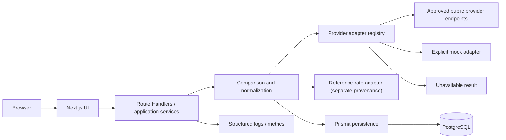
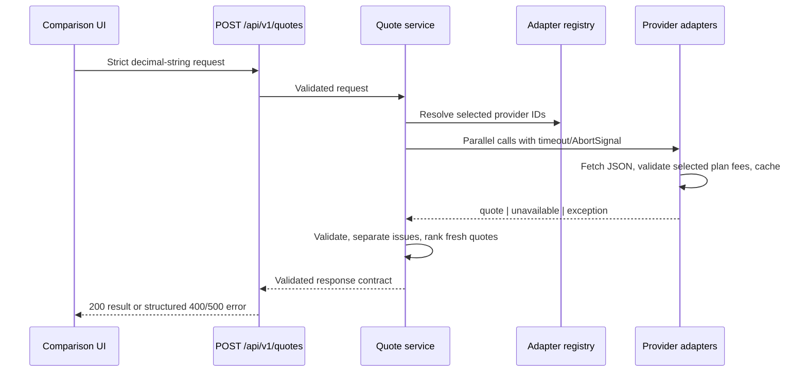

# NeoRate architecture

## System shape

NeoRate is a Next.js App Router application with a domain-first provider boundary. Server Components
compose read views; small Client Components own browser interaction. Route Handlers form the public
HTTP boundary. Provider adapters retrieve and validate provider-specific data, normalize it into a
discriminated `QuoteResult`, and pass it to comparison/application services. PostgreSQL stores
normalized history and availability events through Prisma.

The reference-rate path is intentionally separate. Reference rates may explain a spread, but cannot
be returned as a provider quote.

## Frontend/backend boundary

Interactive inputs and presentational formatting live in client components. Retrieval, secrets,
provider adapters, persistence and authoritative calculations run server-side. External consumers
use the versioned `POST /api/v1/quotes` Route Handler; internal mutations may later use Server
Actions. Domain objects crossing a boundary are runtime-validated.

## Provider adapters and ingestion

Each adapter implements `ProviderAdapter`, validates `QuoteRequest`, retrieves only approved data,
validates the raw response, maps plan/direction/fees/timestamps/provenance, and returns a normalized
result. Ingestion flow: schedule or request → adapter → raw validation → normalization → freshness
classification → persistence → cache → comparison response. Adapter failures become explicit
unavailable observations; they do not trigger a mid-rate fallback.

`ProviderAdapterRegistry` is the only runtime composition point. It exposes registration metadata,
adapter lookup and all configured adapters. Registrations distinguish `SUPPORTED` from deliberately
`UNAVAILABLE`; runtime timeout, exception and invalid-response failures become `FAILED` results.
Adding a provider requires its identifier/schema entry, one isolated adapter, contract tests and one
registry registration—quote orchestration and ranking contain no provider-specific branches.
Registrations may set a provider-specific timeout. The service default is 2 seconds; enabled
Revolut uses 10 seconds without extending the deadline of mock or future providers. Revolut is
registered `UNAVAILABLE` unless `REVOLUT_ADAPTER_ENABLED` is exactly the lowercase string `true`.
Missing, empty, `false`, or any unrecognized value fails safely to disabled and cannot prevent
registry or route-module creation; this optional experimental flag is not parsed by a throwing
module-scope schema and affects no other provider.

The Wise comparison endpoint investigation is deliberately outside the runtime adapter graph.
`src/providers/wise/wise-comparison-parser.ts` validates already-fetched sanitized evidence only;
it performs no network access and Wise has no provider identifier, registry entry, API/UI option,
ranking path, or production feature flag. A future `LIVE_UNOFFICIAL` adapter requires a separate
approved change after the technical, legal, and product restrictions in
`docs/WISE_ENDPOINT_INVESTIGATION.md` are resolved.

The ZEN Pro adapter is isolated under `src/providers/zen`. It posts source-driven form data only to
`https://www.zen.com/landing_currencies.php` through a replaceable server-side transport. The
transport sends JSON accept, form content type, and an identifying NeoRate User-Agent; it never sends
cookies, authorization, browser/session identifiers, Referer, or Cloudflare tokens. A strict
2.5-second source timeout, manual redirects, 64 KiB response limit, content-type/JSON validation,
Zod schemas, decimal.js guardrails and pair/amount/rate consistency checks fail closed. The runtime
does not call `get_currencies.php`; that endpoint is reserved for reference/history data and is not
a ZEN Pro customer quote source. Because current cookie-free server-side probes return HTTP 403 or
a non-quote error envelope, ZEN is registry-disabled unless exact `ZEN_ADAPTER_ENABLED=true` is set
in a controlled environment.

The Revolut personal adapter is isolated under `src/providers/revolut`. Its dedicated client fetches
only `GET https://www.revolut.com/api/exchange/quote` with allowlisted `amount`, `country=HU`,
`fromCurrency`, `isRecipientAmount=false`, and `toCurrency` parameters. It sends JSON accept,
`Accept-Language: hu`, and an identifying NeoRate User-Agent, enforces a 2.5-second per-attempt timeout and response-size limits,
and retries only bounded transient failures. Zod validates every used sender, recipient, rate,
timestamp, plan, fee and tooltip field while allowing unrelated future fields; decimal.js checks
positivity, pair-specific plausibility, sender/recipient/rate consistency and fee-cost consistency.
HTML, redirects, wrong directions, missing plans and malformed content fail closed. No cookies,
authorization, browser identifiers, HTML parser, browser automation, Business API, private app
endpoint, authenticated session or reciprocal rate is in the runtime path.

## Normalization and comparison

Quotes keep source/target currency, source and resulting amounts, effective rate, explicit fee,
total cost, provider plan, rate and retrieval timestamps, source identifiers, data status, freshness
and reliability. Directions are independent; EUR/HUF and HUF/EUR are never inferred from each other.
Financial arithmetic uses decimal.js with 40-digit precision, never JavaScript `number`. Source
values remain decimal strings. The deterministic mock uses `ROUND_HALF_UP`: fees round to
source-currency scale, target values to target-currency scale, and effective rates to 8 decimal
places. The currently supported currency scales are EUR 2 and HUF 0. A real adapter must reproduce
its provider's documented rounding behavior instead of inheriting the mock policy.
In the foundation mock, `totalCost` equals the explicit fee because no verified reference spread is
available. Future spread-derived cost must be stored as a separately named component before it can
be included in `totalCost`, with the cost currency and methodology documented.

For Revolut personal quotes, the adapter boundary implements a provider-specific fixed-hundredth
codec. User major-unit source amounts are multiplied by 100 into exact integer API units; endpoint
`sender`, `recipient`, `fees.fx`, `fees.total`, and `fees.cost` integers are divided by 100 back into
normal major-unit decimal strings. This applies to HUF as well as EUR and is not an ISO 4217 minor-unit
rule. The decoded recipient is the normalized target and is checked against `sender × rawRate` within
0.01 target unit. Provider details retain `ENDPOINT_HUNDREDTH_UNIT_DECODED`. The adapter never adds a
manually calculated fee. Because the public request has no account
identity or prior-usage parameter, results explicitly carry `FULL_ALLOWANCE_ASSUMED`; they cannot
represent consumed rolling 30-day allowance and must be confirmed in the app. Endpoint total fee is
also normalized as `feePercentage = totalFee / senderAmount × 100` with decimal.js. The API retains
the unrounded decimal string; only the UI applies presentation rounding and it increases precision
when necessary so a positive fee never appears as zero.

For ZEN Pro, `data.exchangeRate` is the provider's primary directional rate and is never derived
from the two-decimal endpoint target. The endpoint target remains the customer-visible payout, so
provider-specific effective rate is `targetAmount / sourceAmount`; its difference from the primary
rate transparently reflects endpoint payout rounding. The reciprocal is diagnostic display metadata
only. The official public page states that the ZEN Pro margin is already in the rate and shows zero
additional ZEN fee; provider details record this disclosure rather than inventing another fee. The
endpoint has no source timestamp, so retrieval time is explicitly labeled as the rate timestamp
basis.

The earlier converter/endpoint weekday fee discrepancy was an integration-unit error, not a verified
source gap: requests sent `972` instead of `97200`. Correctly scaled amount-specific responses include
the dynamic fee. Weekday quotes therefore remain rankable using decoded endpoint costs. During Friday 17:00 ET through Sunday
18:00 ET, every Revolut plan is excluded because public-endpoint weekend-fee coverage is unverified;
the window is evaluated in `America/New_York` so DST changes are respected. This guard affects
ranking only and never fabricates a fee.

Every available quote exposes a separate `rankingEffectiveRate`. When a validated source-currency
`providerDetails.totalSourceCost` exists, it is `targetAmount / totalSourceCost`; otherwise it is
`targetAmount / sourceAmount`. This compares fees deducted before conversion with fees charged on
top using one decimal.js metric. Ranking is descending by this value, with ascending provider ID as
the deterministic tie-break. The provider's raw/displayed and provider-specific effective rates keep
their original meanings. Present-but-malformed, non-positive, or wrong-currency total source cost is
a provider-invalid response; fallback applies only when that provider-specific field is absent.
Only fresh `AVAILABLE` quotes with `rankingStatus = ELIGIBLE` enter this sort. If visible quotes exist
but all are excluded or stale, the API returns `NO_RANKABLE_QUOTES` and `bestProviderId = null`.

## Cache and update strategy

There is no shared cache yet. The Revolut quote client has an in-process 60-second fresh cache keyed
by direction, exact normalized source amount, selected plan and every material provider context. Concurrent
refreshes for the same key share one in-flight request. Fetch/parse
failure is negative-cached for 30 seconds to avoid repeated retry storms; this never extends the
source timestamp or stale window. After a failed refresh, the last successful observation may be
returned for at most 15 minutes only with `STALE` status; stale quotes are displayed but never
ranked best. A failed refresh never changes the original `rateTimestamp` or `retrievedAt`. After the
stale interval, the adapter returns unavailable without numbers. A future shared cache must preserve
these semantics.

## Persistence

`Provider`, `ProviderPlan` and directional `CurrencyPair` are reference entities. `QuoteSnapshot`
stores available/stale normalized numeric observations. `ProviderAvailabilityEvent` stores failures
without nullable placeholder amounts. Raw payload storage is optional and must respect provider
terms, privacy, retention and secret-redaction rules.

## Public APIs and data provenance

Public responses must use a versioned schema, validate requests, return the `QuoteResult` union, and
include provenance/status timestamps. `LIVE_OFFICIAL` means documented provider-authorized data;
`LIVE_UNOFFICIAL` requires explicit approval and labeling; `ESTIMATED` must disclose its method;
`MOCK` is development/test only. `UNAVAILABLE` has no numeric values. `STALE` retains the original
source type plus a stale status.

The Revolut JSON endpoint is used by an official Revolut webpage but is not documented as a supported
external personal API, so success is always `LIVE_UNOFFICIAL` with the exact request URL, an indicative
warning and medium reliability. The endpoint's rate timestamp is distinct from NeoRate retrieval time.

The ZEN form endpoint is likewise an undocumented official-webpage source. A validated success is
`LIVE_UNOFFICIAL`, medium reliability, ZEN Pro base, with the exact source URL and an app-verification
warning. `alternatives` is outside the trust boundary and never supplies Revolut or Wise data.

`POST /api/v1/quotes` validates a strict request, including a 30-character amount limit and
currency-specific minimums of 0.01 EUR and 100 HUF, resolves selected adapters through the registry,
calls them in parallel with per-provider abort/timeout support, validates normalized results, ranks
only fresh `AVAILABLE` quotes with positive payouts by cost-normalized effective rate, and validates the response before returning it. A valid request always
gets a `200` domain response even when all providers are unavailable/failed; malformed requests get
structured `400` errors and unexpected route failures get sanitized `500` errors.

## Errors, observability and security

Expected source failures are typed unavailable results. The comparison service isolates unexpected
adapter failures into `error/FAILED` results while emitting structured error logs with request/provider context
but no credentials or raw sensitive payloads; request/schema failures outside an adapter still fail
the request rather than being mislabeled as provider unavailability.
Future production telemetry should measure adapter latency, success rate, quote age, cache behavior
and direction-specific anomalies. Rate-limit public APIs, validate all inputs, use least-privilege DB
credentials, keep secrets in deployment environment variables, pin/scan dependencies, and apply
authorization at the server handler—not only middleware/proxy.

## Deployment and scale

Vercel runs the Next.js application; managed PostgreSQL stores durable data. Migrations run as a
controlled release step, not from request handlers. Scheduled ingestion can begin with Vercel Cron
and move to a durable queue/worker when rate volume or provider limits require it. Provider adapters,
cache and ingestion workers can separate into services without changing the normalized domain/API.
Partition or archive quote history only after measured volume justifies it.

## Provider plan normalization

`src/domain/plan-quote.ts` defines a provider-independent live/derived/unavailable union. Exactly one
available default plan belongs to each top-level provider quote. The quote service still sorts only
top-level quotes, so ZEN Free and Revolut Standard determine provider order; plan expansion cannot
change ranking.

ZEN preserves the live Pro `exchangeRate` and derives Free/Gold/Platinum through official markup
policy. Cache entries are isolated by canonical amount and pair with 60-second fresh, 30-second
negative, 15-minute stale and single-flight behavior. Revolut Standard remains unchanged. Fee-on-top
semantics are proven within Standard, but amount-dependent rates and absent paid-plan responses do
not prove a common plan-independent base. Every paid plan therefore fails closed without numerics.
